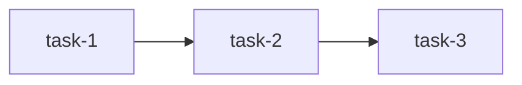

# Шаблоны Architect

## Шаблон задачи (Beads)

```bash
bd create --title="[Краткое название, макс 70 символов]" \
  --type=[task|feature|bug|epic|chore] \
  --priority=[0-4] \
  --description="**Местоположение:**
- Файл: путь/к/файлу
- Модуль/компонент: конкретное место

**Требование из ТЗ:**
> Цитата из источника

**Проблема:**
Чёткое описание (факты, без эмоций)

**Решение:**
1. Конкретный шаг
2. Конкретный шаг

**Критерии готовности:**
- [ ] Критерий 1
- [ ] Критерий 2

**Связанные компоненты:**
- path/to/file1
- path/to/file2"
```

## Приоритеты задач

| Приоритет | Когда использовать |
|-----------|-------------------|
| **P0** | Блокирует запуск, потеря данных, security |
| **P1** | Ломает ключевую функциональность |
| **P2** | Частичная деградация, есть workaround |
| **P3** | Косметика, UX улучшения |
| **P4** | Backlog, nice-to-have |

## Типы задач

| Тип | Назначение |
|-----|-----------|
| `epic` | Крупная фича с подзадачами |
| `feature` | Новая функциональность |
| `task` | Работа без изменения поведения (рефакторинг, документация) |
| `bug` | Что-то сломано |
| `chore` | Обслуживание (CI/CD, зависимости) |

## Шаблон архитектурного документа

```markdown
# [Название системы/модуля]

## Обзор
Краткое описание назначения (2-3 предложения).

## Требования
> Ссылки на источники (ТЗ, GDD, issue-id)

### Функциональные
- FR-1: Требование
- FR-2: Требование

### Нефункциональные
- NFR-1: Производительность/масштабируемость
- NFR-2: Безопасность

## Архитектура

### Компоненты
| Компонент | Ответственность |
|-----------|-----------------|
| Component1 | Что делает |
| Component2 | Что делает |

### Диаграмма
[Mermaid-диаграмма]

### Потоки данных
1. Шаг 1
2. Шаг 2

## Интерфейсы
Публичные API, контракты между модулями.

## Ограничения и допущения
- Ограничение 1
- Допущение 1

## Риски
| Риск | Вероятность | Влияние | Митигация |
|------|-------------|---------|-----------|

## Глоссарий
| Термин | Определение |
|--------|-------------|
```

## Шаблон плана спринта

```markdown
# Sprint [N]: [Название]

**Цель:** Одно предложение — что будет достигнуто.
**Период:** [дата] — [дата]

## Задачи

### P1 (Критичные)
- [ ] [issue-id] Название задачи
  - Исполнитель: Developer
  - Зависимости: [issue-id] или нет
  - Оценка: [часы/дни]

### P2 (Желательные)
- [ ] [issue-id] Название задачи

## Зависимости между задачами


## Риски спринта
- Риск 1 → План B

## Definition of Done
- [ ] Код прошёл ревью
- [ ] Тесты проходят
- [ ] Документация обновлена
```
